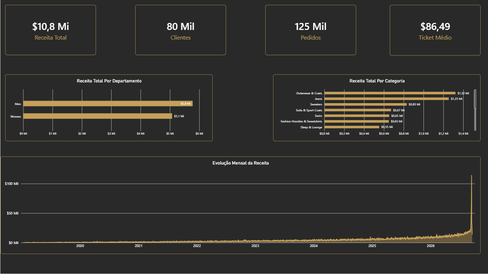
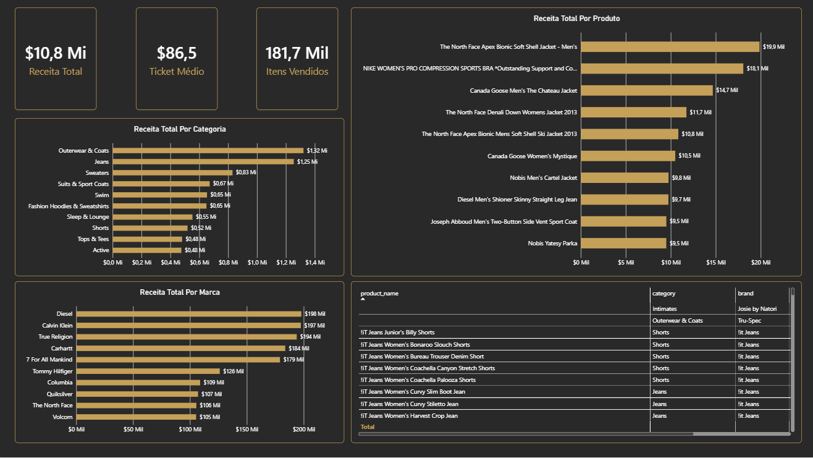
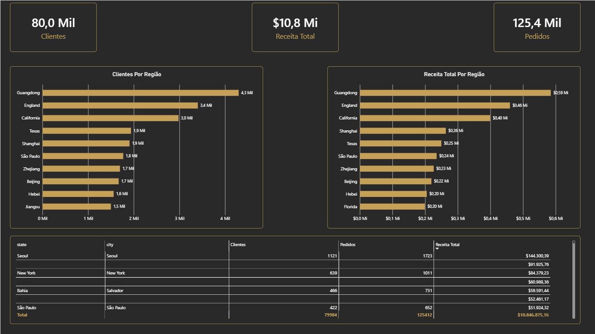

# TheLook E-commerce — End-to-End Analytics

Projeto de Data Analytics desenvolvido utilizando **BigQuery, SQL, modelagem dimensional, DAX e Power BI**, com o objetivo de transformar dados públicos de e-commerce em uma solução analítica completa.

O projeto parte dos dados públicos do **TheLook E-commerce**, realiza análises exploratórias em SQL, constrói um modelo dimensional no BigQuery e utiliza o Power BI para criação de dashboards interativos e análise de indicadores de negócio.

---

## 📊 Visão geral

O projeto foi desenvolvido seguindo um fluxo de análise de dados de ponta a ponta:

**Dados públicos → SQL → BigQuery → Modelagem → DAX → Power BI → Dashboard → Insights**

### Principais indicadores

| Indicador | Resultado |
|---|---:|
| Receita Total | $10,8 Mi |
| Clientes | 80 mil |
| Pedidos | 125 mil |
| Ticket Médio | $86,46 |

---

## 🎯 Objetivo do projeto

O objetivo é analisar o desempenho de um negócio de e-commerce através de diferentes perspectivas:

- Receita
- Pedidos
- Clientes
- Ticket médio
- Produtos
- Categorias
- Marcas
- Departamentos
- Desempenho regional
- Evolução da receita ao longo do tempo

A análise busca transformar dados transacionais em informações que possam apoiar a compreensão do desempenho comercial.

---

# 🗂️ Arquitetura do projeto

O projeto foi estruturado utilizando uma abordagem dimensional, com uma tabela fato central e dimensões relacionadas.

```text
                     DIM_PRODUTO
                          │
                          │
                          ▼
DIM_CLIENTE ───────── FATO_VENDAS ───────── DIM_DATA
```

### FATO_VENDAS

A tabela fato representa o nível transacional do projeto.

**Granularidade:**

> 1 linha = 1 item vendido.

Principais campos:

```text
order_item_id
order_id
product_id
user_id
created_at
sale_date
sale_price
```

A tabela foi construída a partir das tabelas `orders` e `order_items` do dataset público.

---

## 📦 Dimensões

### DIM_PRODUTO

Contém informações relacionadas aos produtos:

```text
product_id
product_name
category
brand
department
retail_price
cost
sku
```

### DIM_CLIENTE

Contém informações relacionadas aos clientes:

```text
user_id
first_name
last_name
gender
age
city
state
country
```

### DIM_DATA

Dimensão utilizada para análises temporais:

```text
date
ano
ano_mes
dia
mes_nome
mes_numero
trimestre
```

---

# 🛢️ BigQuery

O projeto utiliza o dataset público:

```text
bigquery-public-data.thelook_ecommerce
```

Foi criado um dataset próprio no BigQuery:

```text
thelook_bi
```

A partir dos dados públicos foram construídas as estruturas utilizadas na análise.

---

# 💻 SQL

As análises SQL foram desenvolvidas progressivamente, começando por consultas básicas e evoluindo para análises de negócio.

Os exercícios e consultas estão organizados na pasta:

```text
database/
├── bloco1.sql
├── bloco2.sql
├── bloco3.sql
└── bloco4.sql
```

Entre as análises realizadas estão:

- Contagem de clientes
- Contagem de pedidos
- Receita total
- Ticket médio
- Receita mensal
- Receita por departamento
- Receita por categoria
- Receita por marca
- Receita por produto
- Clientes por região
- Receita por região
- Clientes sem pedidos
- Produtos nunca vendidos
- Ranking de produtos
- KPIs mensais

---

# 📐 Modelagem e DAX

Após a etapa de SQL, os dados foram organizados em um modelo dimensional para utilização no Power BI.

As principais métricas utilizadas incluem:

### Receita Total

```DAX
Receita Total =
SUM(FATO_VENDAS[sale_price])
```

### Pedidos

```DAX
Pedidos =
DISTINCTCOUNT(FATO_VENDAS[order_id])
```

### Clientes

```DAX
Clientes =
DISTINCTCOUNT(FATO_VENDAS[user_id])
```

### Ticket Médio

```DAX
Ticket Médio =
DIVIDE(
    [Receita Total],
    [Pedidos]
)
```

---

# 📊 Dashboard

O dashboard foi desenvolvido no Power BI e está dividido em três páginas principais.

## 1. Visão Geral

A página apresenta uma visão executiva do desempenho do e-commerce.

Principais análises:

- Receita total
- Clientes
- Pedidos
- Ticket médio
- Evolução mensal da receita
- Receita por departamento
- Receita por categoria



---

## 2. Produtos & Vendas

Página dedicada à análise do desempenho dos produtos.

Principais análises:

- Receita por categoria
- Receita por produto
- Receita por marca
- Itens vendidos
- Ticket médio
- Receita total
- Detalhamento dos produtos



---

## 3. Performance Regional

Página dedicada à análise geográfica dos clientes e das vendas.

Principais análises:

- Clientes por região
- Receita por região
- Quantidade de pedidos
- Receita total
- Distribuição geográfica dos clientes



> Como o dataset possui dados de diferentes países, os campos geográficos podem representar estados, províncias ou outras divisões administrativas dependendo do país.

---

# 🔎 Perguntas de negócio

O projeto foi desenvolvido para responder perguntas como:

### Receita

- Qual é a receita total?
- Como a receita evolui ao longo do tempo?
- Quais departamentos geram mais receita?
- Quais categorias possuem maior receita?

### Produtos

- Quais produtos geram mais receita?
- Quais marcas apresentam maior receita?
- Quais categorias possuem maior volume de vendas?
- Existem produtos cadastrados que nunca foram vendidos?

### Clientes

- Quantos clientes existem?
- Quantos clientes realizaram pedidos?
- Existem clientes cadastrados sem pedidos?
- Como os clientes estão distribuídos geograficamente?

### Regional

- Quais regiões concentram mais clientes?
- Quais regiões geram mais receita?
- Como os pedidos estão distribuídos regionalmente?

---

# 💡 Principais resultados

A análise consolidada apresentou aproximadamente:

- **$10,8 milhões em receita**
- **125 mil pedidos**
- **80 mil clientes**
- **$86,46 de ticket médio**

O dashboard permite explorar esses indicadores por diferentes dimensões, incluindo tempo, produto, categoria, marca, departamento e região.

> Os valores apresentados são referentes ao conjunto de dados analisado no projeto e não representam necessariamente resultados financeiros reais de uma empresa.

---

# 🛠️ Tecnologias utilizadas

- **Google BigQuery** — armazenamento, consulta e transformação dos dados
- **SQL** — exploração e análise dos dados
- **Modelagem dimensional** — organização do modelo analítico
- **Power BI** — visualização e criação dos dashboards
- **DAX** — criação das métricas e indicadores
- **GitHub** — versionamento e documentação do projeto

---

# 📁 Estrutura do repositório

```text
thelook-end-to-end-analytics/
│
├── database/
│   ├── bloco1.sql
│   ├── bloco2.sql
│   ├── bloco3.sql
│   └── bloco4.sql
│
├── screenshots/
│   ├── pagina1_visao_geral
│   ├── pagina2_produtos
│   └── pagina3_clientes
│
├── THELOOK_ECOMMERCE.pbix
│
└── README.md
```

---

# ▶️ Como reproduzir o projeto

### 1. BigQuery

Utilize o dataset público:

```text
bigquery-public-data.thelook_ecommerce
```

Crie um dataset para as tabelas analíticas:

```text
thelook_bi
```

### 2. SQL

Execute os scripts disponíveis na pasta:

```text
database/
```

### 3. Power BI

Conecte o Power BI às tabelas criadas no BigQuery.

O modelo deve seguir a estrutura:

```text
DIM_CLIENTE
       │
       ▼
FATO_VENDAS
       ▲
       │
DIM_PRODUTO

DIM_DATA
       │
       ▼
FATO_VENDAS
```

### 4. Dashboard

Abra o arquivo:

```text
THELOOK_ECOMMERCE.pbix
```

e utilize as três páginas disponíveis:

```text
Visão Geral
Produtos & Vendas
Performance Regional
```

---

# ⚠️ Limitações dos dados

Este projeto utiliza um dataset público de e-commerce para fins de estudo e portfólio.

Portanto:

- Os dados não representam necessariamente uma empresa real.
- Os resultados financeiros são analíticos e não devem ser interpretados como demonstrações contábeis.
- Informações geográficas podem possuir diferentes nomenclaturas administrativas dependendo do país.
- O ticket médio e demais indicadores dependem do período e dos registros presentes no dataset analisado.

---

# 🚀 Próximos passos

Possíveis evoluções do projeto:

- Publicação do dashboard no Power BI
- Inclusão de análises de margem e lucro estimado
- Análise de comportamento dos clientes
- Análise de retenção e recorrência
- Criação de indicadores adicionais em DAX
- Evolução da documentação e automação das consultas

---

## 👤 Autor

**Diego Moreira**

Projeto desenvolvido como parte do meu portfólio de **Data Analytics / Business Intelligence**.
